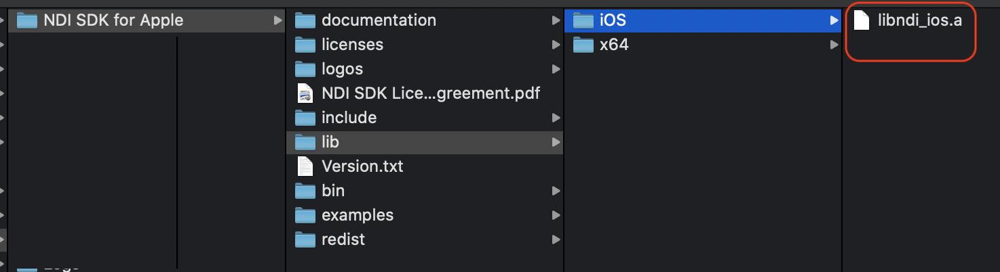
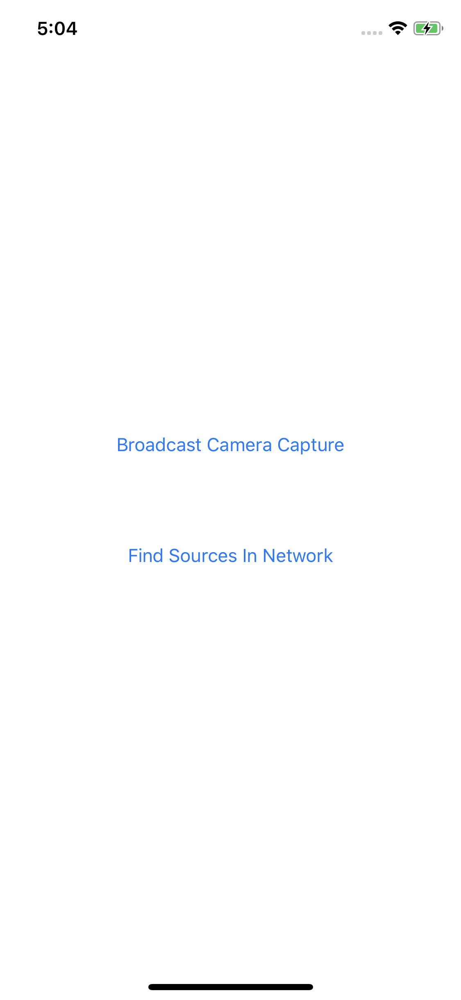
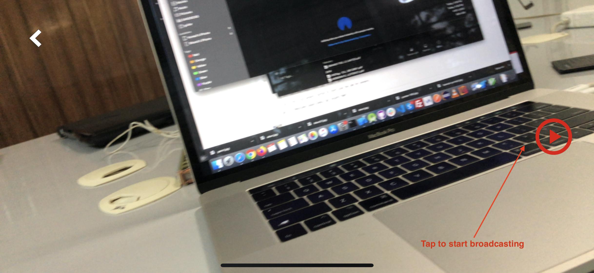

# CameraExampleObjectiveC
 Objective-C sample app for using Ndi SDK 4.5 in iOS

# This is experimental project. Not for use yet!

## Step-1: Clone the repository

## Step-2: Download NDI SDK version 4.5 for iOS and OSX
http://new.tk/NDISDKAPPLE

## Step-3: Install it under home (e.g. /Users/john)
This will create a folder by name "NDI SDK for Apple" under /Users/john

## Step-4: Copy libndi_ios.a
From the 4.5 NDI SDK folder above, copy libndi_ios.a to ios/NdiSDK_4_5/lib/iOS/ folder

This is 622 MB, thats why I did not push to Github

## Step-4: Running sample app

1. Open Finder and navigate to CameraExampleObjectiveC folder. 
2. CLick on "CameraExampleObjectiveC.xcodeproj" to open in Xcode
3. Select Target device and Start Run in Xcode

It will launch the following screen 'First Page'

6. Tap on the 'Broadcast Camera Capture' button to start scan the LAN for senders

